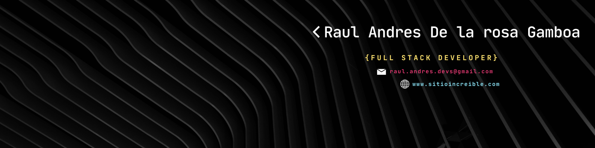

<!-- Header personalizado con imagen propia -->

  

## 👨‍💻 About Me

- 🔥 Passionate Full-Stack Developer focused on building modern and efficient systems.
- 🧩 Specialized in Laravel, Vue, React, Next.js, and cutting-edge web technologies.
- 🎨 Enthusiastic about creating elegant, intuitive, and user-centered interfaces.
- 💡 Constantly learning and crafting innovative digital solutions.
- 🛠️ Currently working on POS systems and custom portfolio websites.

---

## 🧰 Technologies I Work With

 
   

---

## 📈 GitHub Stats

  
  
   
  

---

<!-- Footer con gradiente invertido -->

  

